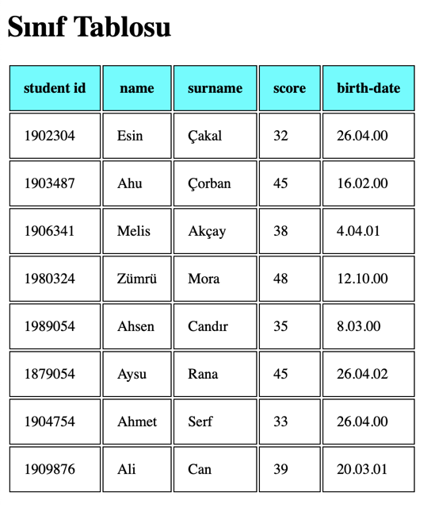

# 📘 Sınıf Tablosu Projesi

Bu basit HTML projesi, temel web yapısını ve tablo kullanımıyla ilgili temel kavramları öğrenmek amacıyla hazırlandı. Dosya içerisinde, öğrencilere ait bilgileri içeren stil verilmiş bir tablo yer alıyor.

## 🔍 İçerik

Bu projede şunlar yer alıyor:

- Temel HTML iskeleti (`<html>`, `<head>`, `<body>` vb.)
- Sayfa başlığı: **Sınıf Tablosu**
- `<table>` etiketiyle oluşturulmuş, başlık satırına sahip bir tablo
- Tablo sütunları:
  - Öğrenci Numarası
  - Adı
  - Soyadı
  - Notu
  - Doğum Tarihi
- Toplamda 8 öğrenci bilgisi
- Basit ve okunabilir bir tablo stili:
  - Tablonun genişliği %100
  - Hücre kenarlıkları ve padding ile daha düzenli görünüm
  - Başlık satırı için farklı arka plan rengi

## 📁 Dosya Yapısı

📦 sinif-tablosu-projesi
├── sinif_tablosu.html
└── README.md

## 📸 Ekran Görüntüsü

### ✨ Not

Bu proje, HTML ve CSS’e yeni başlayanların tablo yapısını, etiket kullanımını ve stil vermeyi öğrenmesi için hazırlandı. Kendi öğrenci bilgilerinle ya da ekstra sütunlarla tabloyu istediğin gibi geliştirebilirsin.
